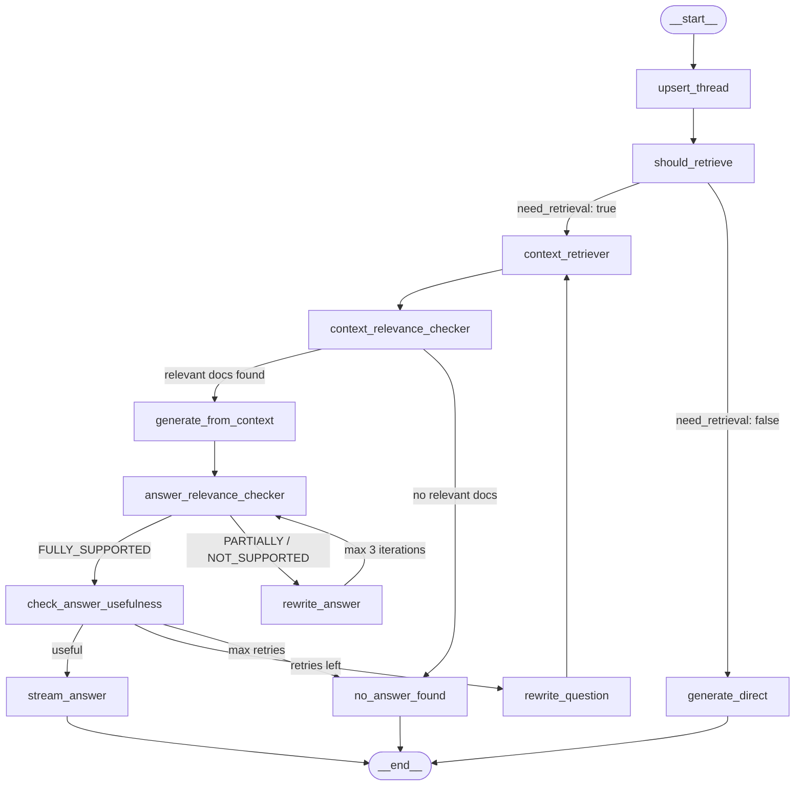

# Self-RAG — NexaAI Assistant

> **Learning project** — built to understand and implement the Self-RAG paper from scratch. The NexaAI company and its documents are fictional, used purely as a realistic knowledge base to exercise the retrieval and grading pipeline.

A **Self-Retrieval-Augmented Generation** API built around **NexaAI**, a dummy company used as the knowledge base for this project. The bot answers questions about NexaAI by grounding every response in three internal PDF documents:

| Document | Contents |
|---|---|
| Company Policy | Internal policies, HR rules, and operational guidelines |
| Company Profile | About NexaAI — mission, team, and background |
| Product & Pricing | Product offerings, plans, and pricing details |

Unlike standard RAG, every step is graded — the system decides whether to retrieve, which docs are relevant, whether the answer is grounded, and whether it actually answers the question. If any check fails, it corrects itself before responding.

Built with **FastAPI**, **LangGraph**, **PostgreSQL + pgvector**, and **Google Gemini**.

> Based on the paper: **Self-RAG: Learning to Retrieve, Generate, and Critique through Self-Reflection**
> Asai et al., 2023 — [arxiv.org/pdf/2310.11511](https://arxiv.org/pdf/2310.11511)

### The 4 Questions Self-RAG Answers

Standard RAG retrieves and generates blindly. Self-RAG adds a critique loop that asks four questions at every step:

| # | Question | Answered by |
|---|---|---|
| 1 | **Should I even retrieve?** | `should_retrieve` — skips vector search for conversational or general questions |
| 2 | **Are the retrieved docs actually relevant?** | `context_relevance_checker` — grades each chunk independently and discards irrelevant ones |
| 3 | **Is the answer grounded in the context?** | `answer_relevance_checker` — detects hallucinations and rewrites the answer if unsupported |
| 4 | **Does the answer actually address the question?** | `check_answer_usefulness` — catches on-topic-but-unhelpful answers and retries with a rewritten query |

---

## Graph


### Preview


---

## How It Works

### 1. Retrieval Gating
The LLM first decides if retrieval is even needed. Conversational or general questions bypass the vector search entirely and go straight to `generate_direct`.

### 2. Context Grading
Retrieved documents are checked for relevance in **parallel** — each doc gets an independent LLM call. Only relevant docs pass through to generation.

### 3. Answer Grounding (Self-RAG core)
After generation, the answer is graded against the context:
- `FULLY_SUPPORTED` → pass
- `PARTIALLY_SUPPORTED` / `NOT_SUPPORTED` → rewrite the answer (up to 3 iterations)

### 4. Usefulness Check
Even a grounded answer might not actually answer the question. A final usefulness check catches this case and either accepts the answer, rewrites the **query** for better retrieval, or gives up with `no_answer_found`.

### 5. Streaming
The final approved answer is streamed to the client in one shot. The answer is held in state during the grading/rewriting loops — streaming mid-loop would be irreversible.

---

## Node Reference

| Node | Description |
|---|---|
| `upsert_thread` | Creates or loads the conversation thread and its message history. |
| `should_retrieve` | LLM decides if the question needs document retrieval or can be answered directly (e.g. greetings, general knowledge). |
| `generate_direct` | Generates a response without any context — used for conversational or general questions. |
| `context_retriever` | Runs a vector similarity search against the NexaAI PDFs using the original question or a rewritten query. Returns top-3 chunks. |
| `context_relevance_checker` | Checks each retrieved chunk independently (parallel LLM calls) and filters out irrelevant ones. |
| `generate_from_context` | Generates an answer strictly from the relevant chunks. Instructed not to use outside knowledge. |
| `answer_relevance_checker` | Grades the answer as `FULLY_SUPPORTED`, `PARTIALLY_SUPPORTED`, or `NOT_SUPPORTED` against the context. Catches hallucinations and unsupported claims. |
| `rewrite_answer` | Revises the answer to remove unsupported or interpretive claims, keeping only direct quotes from context. Loops back to `answer_relevance_checker` (max 3 times). |
| `check_answer_usefulness` | Checks whether the grounded answer actually addresses what the user asked. A factually correct answer can still be off-topic. |
| `rewrite_question` | Rewrites the original question into a better retrieval query with domain-specific keywords. Resets doc state and loops back to `context_retriever` (max 3 times). |
| `stream_answer` | Pushes the final approved answer to the SSE stream queue and persists it to the database. |
| `no_answer_found` | Terminal node returned when no relevant docs exist or all rewrite attempts are exhausted. |

---

## Stack

| | |
|---|---|
| API | FastAPI |
| Graph / Orchestration | LangGraph |
| LLM | Google Gemini |
| Vector store | PostgreSQL + pgvector |
| ORM | SQLAlchemy 2 (async) |
| Migrations | Alembic |
| Background tasks | SQS consumer + S3 (localstack locally) |
| Python | 3.12+ |

---

## Getting Started

### Prerequisites

- Docker & Docker Compose
- Python 3.12+
- [uv](https://github.com/astral-sh/uv)

### Setup

```bash
# 1. Clone and install
git clone <repo-url>
cd self-rag
uv sync

# 2. Configure environment
cp .env.example .env
# Fill in: DATABASE_URL, GOOGLE_API_KEY, AWS_ENDPOINT_URL, etc.

# 3. Start services (Postgres + localstack for S3/SQS)
docker-compose up -d

# 4. Run migrations
alembic upgrade head

# 5. Start the API
uvicorn app.main:app --reload

# 6. Start the SQS consumer (for document ingestion)
python -m app.worker.sqs_consumer
```

---

## API Endpoints

| Method | Path | Description |
|---|---|---|
| `POST` | `/threads` | Create a new conversation thread |
| `POST` | `/threads/{id}/chat` | Send a message (streaming response) |
| `POST` | `/documents` | Upload a document for ingestion |
| `GET` | `/health` | Health check |

---

## Project Structure

```
app/
├── api/            # Routers, controllers, request/response models
├── bot/
│   ├── nodes/      # One file per graph node
│   ├── state.py    # RAGState definition
│   └── llm.py      # Shared LLM + parser instances
├── rag/
│   ├── graph.py    # Graph builder (RAGGraph)
│   ├── retriever.py
│   └── ingestor/   # PDF ingestion pipeline
├── db/
│   ├── models/     # SQLAlchemy ORM models
│   └── services/   # Async DB service layer
├── worker/         # SQS producer/consumer, ingestion entrypoint
├── core/           # Config, logging, exception handling
└── middlewares/    # Auth, API tracing
```